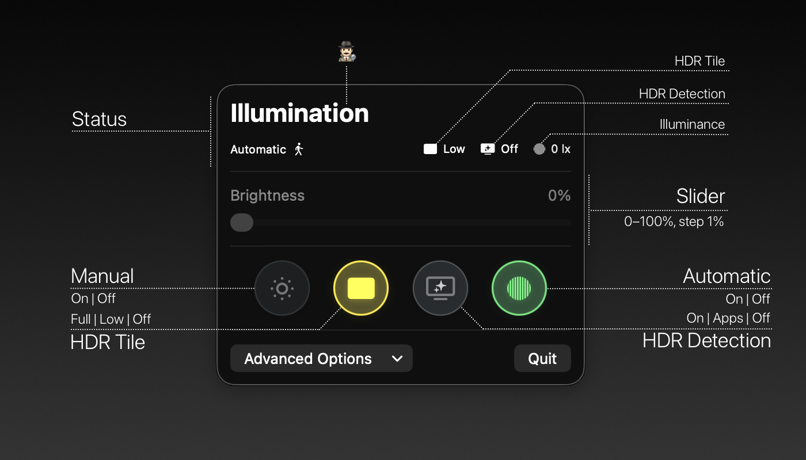

# Illumination


---

Illumination is a powerful yet minimal macOS menu bar utility designed to unlock the full brightness potential of Apple XDR and other EDR-capable displays. It intelligently extends the SDR brightness range while respecting HDR content and adapting to your environment.

> ⚠️ Experimental project
>
> Expect rough edges, broken promises and ruined displays. Use at your own risk. If you need a production-ready tool, consider established alternatives. Some noteworthy ones are listed below.
>
> - [BrightIntosh](https://github.com/niklasr22/BrightIntosh)


## Features

- Auto-Detection of EDR capable displays. ⚠️ Only Built-In at the moment ⚠️
- Seamless System Integration: Illumination is designed to work with the native macOS auto-brightness feature enabled.
-   **Robust Ambient Light Sensing Engine:**
    A custom signal processing pipeline that converts macOS's raw `AmbientBrightness` data into a stable and accurate real-time illuminance (lux) estimate. It's engineered to be reliable from dim indoor environments to direct sunlight without using private APIs or requiring App Sandbox entitlements.

    Key techniques include:
    -   **Resilient Decoding:** Safely handles raw fixed-point data, overflow sentinels, and sensor saturation events.
    -   **Adaptive Smoothing:** A time-delta-aware EMA filter minimizes noise without sacrificing responsiveness.
    -   **Dual-Model Calibration:** A unique confidence-based blending of a direct power-law model with a day-adaptive relative model ensures accuracy in all lighting conditions.

    The complete methodology is detailed in our [**technical paper on the lux estimation algorithm**](assets/Algorithm.pdf).
- Extended Dynamic Range (EDR): Go beyond the standard SDR brightness limits.
- Ambient Light Sensing (ALS): Automatically toggles EDR and adjusts brightness based on your ambient lighting. Choose from multiple sensitivity profiles (Aggressive, Normal, Conservative) to match your preference.
- HDR-Aware Ducking: A standout feature that automatically reduces the brightness boost when HDR content is detected. This preserves the creative intent of HDR media without requiring manual intervention. ⚠️ Partially working ⚠️
- Persistent HDR Tile: An optional, small video tile that can be placed in a corner of the screen to ensure EDR mode remains active, keeping EDR engaged within fullscreen applications/spaces.
- Debug submenu with extended diagnostics and fine-grained control settings.

## Getting Started: Building from Source

This project uses a `Makefile` to automate the build process.

#### 1. Prerequisites

- macOS with Xcode (26+ recommended) installed.
- Clone the repository:
  ```bash
  git clone https://github.com/peterneutron/illumination.git
  ```

#### 2. One-Time Setup in Xcode

Before you can build from the command line, you need to configure code signing once in Xcode.

1.  Open `Illumination.xcodeproj` in Xcode.
2.  In the project navigator, select the "Illumination" project, then the "Illumination" target.
3.  Go to the **"Signing & Capabilities"** tab.
4.  From the **"Team"** dropdown, select your personal Apple ID. Xcode will automatically create a local development certificate for you.
5.  You can now close Xcode.

#### 3. Build the App

From the root of the project directory, run the main `make` command:

```bash
make
```
This command will:
- Build and archive the application.
- Export a clean, runnable `Illumination.app` into a `./build` directory.

You can now run the app from the `./build` folder.

## Acknowledgments

- [BrightIntosh](https://github.com/niklasr22/BrightIntosh)
- Google Gemini and OpenAI GPT families of models and all the labs involved making these possible 🙏