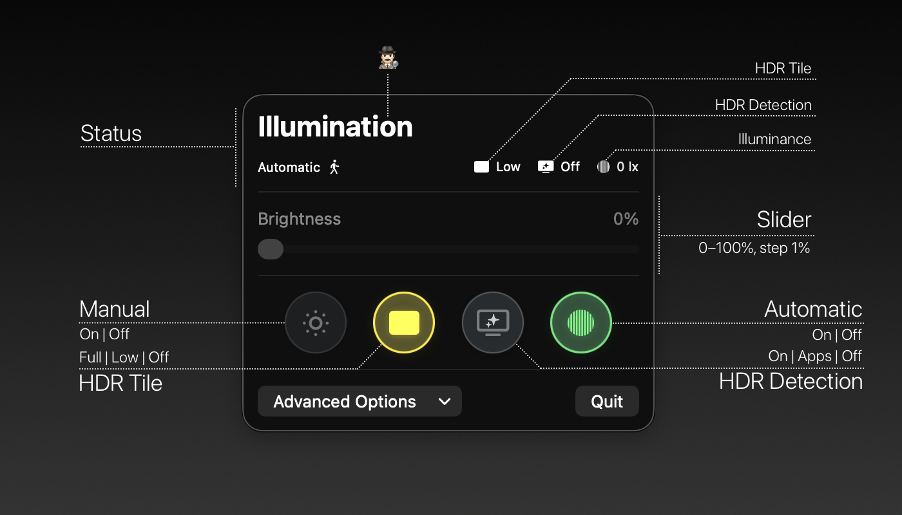

# Illumination


Illumination is a macOS menu bar app that extends SDR brightness into EDR on compatible built-in displays while adapting to ambient light and app policy.

## Scope

Use Illumination when you need:

- ambient-light-driven EDR headroom control
- menu bar brightness control that coexists with macOS auto-brightness
- per-app policy gating for when Illumination is allowed to run
- an optional HDR tile to keep EDR active in fullscreen spaces
- debug and replay tools for ALS and HDR investigations

## Build

```bash
make build
```

## Verify

```bash
make verify
```

Common local targets:

- `make xcodegen`
- `make xcodegen-check`
- `make lint`
- `make test`
- `make build`

## Docs

Keep the README short. Detailed material lives elsewhere:

- [Contract and Architecture](docs/contracts.md)
- [Release Process](docs/release.md)
- [Agent Instructions](AGENTS.md)
- [Algorithm Paper](assets/Algorithm.pdf)

## Runtime Notes

- built-in displays only for now
- Screen Recording permission is only relevant for the experimental HDR detector paths
- policy precedence is strict: app denylist, then master and mode state, then experimental HDR detector
- high-brightness EDR operation can materially increase heat and power draw

## Safety

Illumination intentionally drives display brightness behavior beyond the standard SDR path. Test changes on real hardware and prefer reversible, bounded experiments when tuning ALS or EDR policy.
